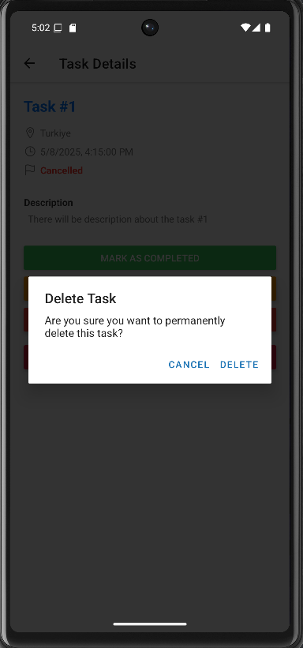

# Task Manager App

A clean, modular, and locally persistent React Native mobile app for managing tasks in the field.

---

## Purpose

This project was designed to assess core mobile development competencies using modern tooling, strong coding standards, and an intuitive user interface. The goal was to create a task management app that works seamlessly offline using local storage and showcases clean architecture practices.

---

## Screenshots

### Home


### Add Task Screens


### Task List Screens


### Task Details Screens


### Delete Task



---

## Key Features

- **Add Tasks**: Create new tasks with title, description, date/time, and location
- **Task Listing**: View all tasks with status indicators
- **Status Management**: Mark tasks as `Pending`, `In Progress`, `Completed`, or `Cancelled`
- **Delete Tasks**: Delete tasks with confirmation
- **Offline Persistence**: All task data is saved locally using `AsyncStorage`
- **Modern UI**: Uses Ionicons and modular components for a clean, consistent look
- **Error Handling**: Form validation and fail-safe logic throughout

---

## Tech Stack

| Layer            | Tech Used                                             |
|------------------|--------------------------------------------------------|
| Framework        | [React Native](https://reactnative.dev/) + [Expo](https://expo.dev) |
| Routing          | [Expo Router](https://expo.github.io/router/)         |
| State/Storage    | AsyncStorage                                          |
| Styling          | React Native `StyleSheet` + centralized constants     |
| Icons            | Ionicons via `@expo/vector-icons`                     |
| Date Handling    | `react-native-modal-datetime-picker`                  |
| Language         | **TypeScript**                                        |

---

## Clean Code Philosophy

The entire codebase follows industry-standard **clean code** principles:

- **SRP** (Single Responsibility Principle): Each function/component does exactly one thing
- **Meaningful naming**: Variables and functions are purpose-driven
- **Modularization**: Constants, components, storage utilities are separated
- **JSDoc comments**: For all major functions and helpers
- **Minimal side effects**: Async operations are safely wrapped
- **Development logging**: Active only in `__DEV__` mode for clarity

---

## Setup & Usage

### Prerequisites

- Node.js ≥ 16
- Expo CLI: `npm install -g expo-cli`
- Android Emulator or Expo Go App

### Running Locally

```bash
# 1. Install dependencies
npm install

# 2. Start development server
npx expo start
